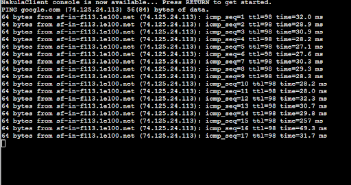

# Jarkom-Modul-2-D05-2023
**Praktikum Jaringan Komputer Modul 2 Tahun 2023**

## Author
| Nama | NRP |Github |
|---------------------------|------------|--------|
|Ihsan Widagdo | 5025211231 | https://github.com/dagdo03 |
|Sandyatama Fransisna Nugraha | 5025211196 | https://github.com/TamaFn | 

# Laporan Resmi 
## Daftar Soal dan Jawaban
- [Laporan Resmi](#laporan-resmi)
  - [Daftar Isi](#daftar-isi)
  - [Topologi](#topologi)
  - [Config](#config)
  - [Konfigurasi IP Pada Masing" Node](#sebelum-memulai)
- [Soal 1](#Soal-1)
  - [Script](#script)
  - [Result](#result)
- [Soal 2](#Soal-2)
  - [Script](#script-1)
  - [Result](#result-1)
- [Soal 3](#Soal-3)
  - [Script](#script-2)
  - [Result](#result-2)
- [Soal 4](#Soal-4)
  - [Script](#script-3)
  - [Result](#result-3)
- [Soal 5](#Soal-5)
  - [Script](#script-4)
  - [Result](#result-4)
- [Soal 6](#Soal-6)
  - [Script](#script-5)
  - [Result](#result-5)
- [Soal 7](#Soal-7)
  - [Script](#script-6)
  - [Result](#result-6)
- [Soal 8](#Soal-8)
  - [Script](#script-7)
  - [Result](#result-7)
- [Soal 9](#Soal-9)
  - [Script](#script-8)
  - [Result](#result-8)
- [Soal 10](#Soal-10)
  - [Script](#script-9)
  - [Result](#result-9)
- [Soal 11](#Soal-11)
  - [Script](#script-10)
  - [Result](#result-10)
- [Soal 12](#Soal-12)
  - [Script](#script-11)
  - [Result](#result-11)
- [Soal 13](#Soal-13)
  - [Script](#script-12)
  - [Result](#result-12)
- [Soal 14](#Soal-14)
  - [Script](#script-13)
  - [Result](#result-13)
- [Soal 15](#Soal-15)
  - [Script](#script-14)
  - [Result](#result-14)
- [Soal 16](#Soal-16)
  - [Script](#script-15)
  - [Result](#result-15)
- [Soal 17](#Soal-17)
  - [Script](#script-16)
  - [Result](#result-16)
- [Soal 18](#Soal-18)
  - [Script](#script-17)
  - [Result](#result-17)
- [Soal 19](#Soal-19)
  - [Script](#script-18)
  - [Result](#result-18)
- [Soal 20](#Soal-20)
  - [Script](#script-19)
  - [Result](#result-19)

## Topologi Soal Model 2


### Panduan Memulai Modul
Langkah pertama adalah memulai instalasi GNS3 pada Virtual. Untuk memulai instalsi dapat dilakukan dengan mengikuti instruksi dari sini [Instalasi GNS3](https://github.com/arsitektur-jaringan-komputer/Modul-Jarkom/tree/master/Modul-GNS3). Setelah berhasil melakukan instalasi pada GNS3 pada Virtual Box, maka ketika di run akan muncul tampilan seperti ini. 


Langkah selanjutnya adalah membuka link http://192.168.0.3 dan membuat topologi yang sama seperti diatas. Hasil dari topologi yang kita buat kira-kira seperti ini :


### Sebelum memulai 

Sebelum memulai setting node, konfigurasikan tiap-tiap node dengan mengganti nama pada tiap-tiap nodes dengan change hostname dan change symbol agar dapat dibedakan. Lalu, setting masing-masing nodes dengan IP sesuai dengan arah line dengan tombol configure lalu edit network configuration. Jalankan program jaringan dengan tombol play dalam tampilannya. 
Karena kelompok kami mendapat IP 10.24.xxx.xxx, maka ganti sesuai ip berikut.

### Konfigurasi IP Pada Masing" Node 
- **Pandudewanata**
  ```
  auto eth0
  iface eth0 inet dhcp

  auto eth1
  iface eth1 inet static
          address 10.24.1.1
          netmask 255.255.255.0

  auto eth2
  iface eth2 inet static
          address 10.24.2.1
          netmask 255.255.255.0

  auto eth3
  iface eth3 inet static
          address 10.24.3.1
          netmask 255.255.255.0
  ```
- **Sadewa**
  ```
  auto eth0
  iface eth0 inet static
          address 192.173.1.2
          netmask 255.255.255.0
          gateway 192.173.1.1
  ```
- **Nakula**
  ```
  auto eth0
  iface eth0 inet static
          address 192.173.1.3
          netmask 255.255.255.0
          gateway 192.173.1.1
  ```
- **Yudhistira**
  ```
  auto eth0
  iface eth0 inet static
          address 10.24.2.2
          netmask 255.255.255.0
          gateway 10.24.2.1
  ```
- **Werkudara**
  ```
  auto eth0
  iface eth0 inet static
          address 192.173.3.2
          netmask 255.255.255.0
          gateway 192.173.3.1
  ```

- **Arjuna**
  ```
  auto eth0
  iface eth0 inet static
          address 192.173.3.3
          netmask 255.255.255.0
          gateway 192.173.3.1
  ```
- **Abimanyu**
  ```
  auto eth0
  iface eth0 inet static
          address 192.173.3.4
          netmask 255.255.255.0
          gateway 192.173.3.1
  ```
- **Prabukusuma**
  ```
  auto eth0
  iface eth0 inet static
          address 192.173.3.5
          netmask 255.255.255.0
          gateway 192.173.3.1
  ```

- **Wisanggeni**
  ```
  auto eth0
  iface eth0 inet static
          address 192.173.3.6
          netmask 255.255.255.0
          gateway 192.173.3.1
  ```

- **Alamat IP Pada Masing-masing Node**
  ```
  Pandudewanata	: 10.24.1.1 (Switch 1)
  Pandudewanata	: 10.24.2.1 (Switch 2)
  Pandudewanata	: 10.24.1 (Switch 3)
  Sadewa	        : 10.24.1.2
  Nakula	        : 10.24.1.3
  Yudhistira	: 10.24.2.2
  Werkudara	: 10.24.3.2
  Arjuna	        :10.24.3.3
  Abimanyu	: 10.24.3.4
  Prabukusuma	: 10.24.3.5
  Wisanggeni	: 10.24.3.6
  ```

Lakukan instalasi setiap node menggunakan  `nano .bashrc` agar tiap node siap melakukan konfigurasi

- **Pandudewanata**
  ```
  iptables -t nat -A POSTROUTING -o eth0 -j MASQUERADE -s 10.24.0.0/16
  echo 'nameserver 192.168.122.1' > /etc/resolv.conf
  ```
- **Master & Slave**
  ```
  echo 'nameserver 192.168.122.1' > /etc/resolv.conf
  apt-get update
  apt-get install bind9 -y      
  ```
- **Client**
  ```
  echo -e '
  nameserver 10.24.2.2 # IP Yudhistira
  nameserver 10.24.3.2 # IP Werkudara
  nameserver 192.168.122.1
  ' > /etc/resolv.conf
  apt-get update
  apt-get install dnsutils -y
  apt-get install lynx -y
  ```
- **Nginx Config**
  ```
  apt install nginx php php-fpm -y
  ```
- **Apache2 Config**
  ```
  apt-get update
  apt-get install dnsutils -y
  apt-get install lynx -y
  apt-get install nginx -y
  service nginx start
  apt-get install apache2 -y
  apt-get install libapache2-mod-php7.0 -y
  service apache2 start
  apt-get install wget -y
  apt-get install unzip -y
  apt-get install php -y
  echo -e "\n\nPHP Version:"
  php -v
  ```
- **Zip Download and Unzip**
  ```
  wget -O '/var/www/abimanyu.a09.com' 'https://     drive.usercontent.google.com/download?id=1a4V23hwK9S7hQEDEcv9FL14UkkrHc-Zc'
  unzip -o /var/www/abimanyu.a09.com -d /var/www/
  mv /var/www/abimanyu.yyy.com /var/www/abimanyu.a09
  rm /var/www/abimanyu.a09.com
  rm -rf /var/www/abimanyu.yyy.com

  wget -O '/var/www/parikesit.abimanyu.a09.com' 'https://drive.usercontent.google.com/download?id=1LdbYntiYVF_NVNgJis1GLCLPEGyIOreS'
  unzip -o /var/www/parikesit.abimanyu.a09.com -d /var/www/
  mv /var/www/parikesit.abimanyu.yyy.com /var/www/parikesit.abimanyu.a09
  rm /var/www/parikesit.abimanyu.a09.com
  rm -rf /var/www/parikesit.abimanyu.yyy.com
  mkdir /var/www/parikesit.abimanyu.a09/secret

  wget -O '/var/www/rjp.baratayuda.abimanyu.a09.com' 'https://drive.usercontent.google.com/download?id=1pPSP7yIR05JhSFG67RVzgkb-VcW9vQO6'
  unzip -o /var/www/rjp.baratayuda.abimanyu.a09.com -d /var/www/
  mv /var/www/rjp.baratayuda.abimanyu.yyy.com /var/www/rjp.baratayuda.abimanyu.a09
  rm /var/www/rjp.baratayuda.abimanyu.a09.com
  rm -rf /var/www/rjp.baratayuda.abimanyu.yyy.com
  ```

## Soal 1 
> Yudhistira akan digunakan sebagai DNS Master, Werkudara sebagai DNS Slave, Arjuna merupakan Load Balancer yang terdiri dari beberapa Web Server yaitu Prabakusuma, Abimanyu, dan Wisanggeni. Buatlah topologi dengan pembagian sebagai berikut. Folder topologi dapat diakses pada drive berikut


Untuk melakukan testing pengujian apakah sudah sesuai ip kelompok, maka lakukan sebagai berikut pada nodes Pandudewanata,  

```R
ip a
```

Apabila sudah benar, maka akan muncul hasil yang seperti ini


Bisa kita lihat bahwa IP sudah berjalan pada IP yang sudah kita setting. Langkah selanjutnya adalah mengakses jaringan luar dengan menuliskan kode program dibawah ini. Lalu cek apakah sudah bekerja atau tidak.
 

```R
  iptables -t nat -A POSTROUTING -o eth0 -j MASQUERADE -s 192.173.0.0/16
  echo 'nameserver 192.168.122.1' > /etc/resolv.conf
``` 

Apabila sudah benar, maka akan muncul hasil yang seperti ini
<br>


Lalu tuliskan masing-masing node dengan kode program dibawah ini untuk melakukan tes ping koneksi dengan ping google.com. 

```R
echo nameserver 192.168.122.1 > /etc/resolv.conf
```

Apabila sudah benar, maka akan seperti ini :



## Soal 2
> Buatlah website utama pada node arjuna dengan akses ke arjuna.yyy.com dengan alias www.arjuna.yyy.com dengan yyy merupakan kode kelompok.

Karena DNS akan hilang saat dihentikan, maka penggunaan script.sh sangat diperlukan agar proses dapat berjalan dengan optimal dan tidak berulang-ulang. Untuk melakukannya, ketikkan nano .bashrc pada web console. Lalu tuliskan kembali langkah sebelumnya dibawah. 

(Contoh pada Client Nakula)


### Script
**Yudhistira**
```
echo nameserver 192.168.122.1 > /etc/resolv.conf
apt-get update
apt-get install bind9 -y
echo 'zone "arjuna.D05.com"{  
	type master;
	file "/etc/bind/jarkom/arjuna.D05.com";
};' > /etc/bind/named.conf.local
mkdir /etc/bind/jarkom
cp /etc/bind/db.local /etc/bind/jarkom/arjuna.D05.com
echo ';
; BIND data file for local loopback interface
;
$TTL    604800
@       IN      SOA     arjuna.D05.com. root.arjuna.D05.com. (
                              2         ; Serial
                         604800         ; Refresh
                          86400         ; Retry
                        2419200         ; Expire
                         604800 )       ; Negative Cache TTL
;
@       IN      NS      arjuna.D05.com.
@       IN      A       10.24.3.3       ; IP Arjuna 
www     IN      CNAME   arjuna.D05.com.
@       IN      AAAA    ::1' > /etc/bind/jarkom/arjuna.D05.com
service bind9 restart

```

**Nakula dan Sadewa**

Jangan lupa untuk setup nameserver terlebih dahulu yang diarahkan ke `IP Node yudhistira`

```
echo nameserver 192.168.122.1 > /etc/resolv.conf
apt-get update
apt-get install dnsutils
echo nameserver 10.24.2.2 > /etc/resolv.conf
ping arjuna.D05.com
```

### Result


## Soal 3 
> Dengan cara yang sama seperti soal nomor 2, buatlah website utama dengan akses ke abimanyu.yyy.com dan alias www.abimanyu.yyy.com.

Langkah-langkah yang dilakukan sama dengan yang nomor 2,  akan tetapi ada perbedaan kode program. Tuliskan kode program ini pada node `Yudhistira`

### Script
**Yudhistira**
```
echo 'zone "abimanyu.D05.com"{  
        type master;
        file "/etc/bind/jarkom/abimanyu.D05.com";
};' >> /etc/bind/named.conf.local
cp /etc/bind/db.local /etc/bind/jarkom/abimanyu.D05.com
echo ';
; BIND data file for local loopback interface
;
$TTL    604800
@       IN      SOA     abimanyu.D05.com. root.abimanyu.D05.com. (
                              2         ; Serial
                         604800         ; Refresh
                          86400         ; Retry
                        2419200         ; Expire
                         604800 )       ; Negative Cache TTL
;
@       IN      NS      abimanyu.D05.com.
@       IN      A       10.24.3.4       ; IP Abimanyu 
www     IN      CNAME   abimanyu.D05.com.
@       IN      AAAA    ::1' > /etc/bind/jarkom/abimanyu.D05.com
service bind9 restart
```


**Nakula dan Sadewa**
```
echo nameserver 10.24.2.2 > /etc/resolv.conf
host -t CNAME www.abimanyu.D05.com  
ping www.abimanyu.D05.com -c 5
```

### Result


## Soal 4
> Kemudian, karena terdapat beberapa web yang harus di-deploy, buatlah subdomain parikesit.abimanyu.yyy.com yang diatur DNS-nya di Yudhistira dan mengarah ke Abimanyu.

Langkah-langkah yang dilakukan sama dengan nomor 3,  akan tetapi ada penambahan subdomain dengan nama parikesit pada kode program. Tuliskan kode program ini pada web console `Yudhistira`

### Script
**Yudhistira**
```
echo ';
; BIND data file for local loopback interface
;
$TTL    604800
@       IN      SOA     abimanyu.D05.com. root.abimanyu.D05.com. (
                              2         ; Serial
                         604800         ; Refresh
                          86400         ; Retry
                        2419200         ; Expire
                         604800 )       ; Negative Cache TTL
;
@       IN      NS      abimanyu.D05.com.
@       IN      A       10.24.3.4       ; IP Abimanyu 
www     IN      CNAME   abimanyu.D05.com.
parikesit   IN  A   10.24.3.4   ; IP Abimanyu
@       IN      AAAA    ::1' > /etc/bind/jarkom/abimanyu.D05.com
service bind9 restart
```

**Nakula dan Sadewa**
```
ping parikesit.abimanyu.D05.com
```

### Result


## Soal 5 
> Buat juga reverse domain untuk domain utama. (Abimanyu saja yang direverse)

Langkah-langkah selanjutnya adalah menuliskan kembali kode program yang berupa penambahan nama domain reverse dalam `Yudhistira`. Kode program adalah seperti ini

### Script
**Yushistira**
```
echo 'zone "3.24.10.in-addr.arpa" {
    type master;
    file "/etc/bind/jarkom/3.24.10.in-addr.arpa";
};' >> /etc/bind/named.conf.local

cp /etc/bind/db.local /etc/bind/jarkom/3.24.10.in-addr.arpa
echo '
;
; BIND data file for local loopback interface
;
$TTL    604800
@       IN      SOA     abimanyu.D05.com. root.abimanyu.D05.com. (
                              2         ; Serial
                         604800         ; Refresh
                          86400         ; Retry
                        2419200         ; Expire
                         604800 )       ; Negative Cache TTL
;
3.24.10.in-addr.arpa.   IN  NS   abimanyu.D05.com.   ; IP Abimanyu
4       IN  PTR  abimanyu.D05.com.   ; 
' > /etc/bind/jarkom/3.24.10.in-addr.arpa

service bind9 restart
```

**Nakula dan Sadewa**
```
echo nameserver 10.24.2.2 > /etc/resolv.conf
host -t PTR 10.24.3.4
```

### Result


## Soal 6 
> Agar dapat tetap dihubungi ketika DNS Server Yudhistira bermasalah, buat juga Werkudara sebagai DNS Slave untuk domain utama.

Untuk mengerjakan DNS Slave, kita memerlukan beberapa konfigurasi pada `DNS Master` dan `DNS Slave (Werkudara)`

### Script
**Yudhistira**
```
echo 'zone "abimanyu.D05.com" {
    type master;
    notify yes;
    also-notify { 10.24.3.2; };
    allow-transfer { 10.24.3.2; };
    file "/etc/bind/jarkom/abimanyu.D05.com";
};
zone "arjuna.D05.com" {
        type master;
        notify yes;
        also-notify { 10.24.3.2; };
        allow-transfer { 10.24.3.2; };
        file "/etc/bind/jarkom/arjuna.D05.com";
};
zone "3.24.10.in-addr.arpa" {
    type master;
    file "/etc/bind/jarkom/3.24.10.in-addr.arpa";
};' > /etc/bind/named.conf.local
service bind9 restart
service bind9 stop
```

**Werkudara**
```
echo nameserver 192.168.122.1 > /etc/resolv.conf
apt-get update
apt-get install bind9 -y
echo 'zone "abimanyu.D05.com" {
    type slave;
    masters { 10.24.2.2; }; // Masukan IP DNS Master
    file "/var/lib/bind/abimanyu.D05.com";
};' > /etc/bind/named.conf.local
service bind9 restart
```

**Nakula dan Sadewa**
```
echo nameserver 10.24.2.2 > /etc/resolv.conf
host -t PTR 10.24.3.4
```

### Result


## Soal 7 
> Seperti yang kita tahu karena banyak sekali informasi yang harus diterima, buatlah subdomain khusus untuk perang yaitu baratayuda.abimanyu.yyy.com dengan alias www.baratayuda.abimanyu.yyy.com yang didelegasikan dari Yudhistira ke Werkudara dengan IP menuju ke Abimanyu dalam folder Baratayuda.

Untuk melakukan Delegasi subdomain,  kita memerlukan beberapa configurasi pada DNS Master dan DNS Slave. Kita juga meemerlukan beberapa modifikasi pada `/etc/bind/named.conf.options`

### Script
**Yudhistira**
```
echo ';
; BIND data file for local loopback interface
;
$TTL    604800
@       IN      SOA     abimanyu.D05.com. root.abimanyu.D05.com. (
                              2         ; Serial
                         604800         ; Refresh
                          86400         ; Retry
                        2419200         ; Expire
                         604800 )       ; Negative Cache TTL
;
@       IN      NS      abimanyu.D05.com.
@       IN      A       10.24.3.4       ; IP DNS Master
www     IN      CNAME   abimanyu.D05.com.
parikesit       IN      A       10.24.3.4       ; IP abimanyu
ns1     IN      A       10.24.3.2 ; IP werkudara
baratayuda      IN      NS      ns1
@       IN      AAAA    ::1' > /etc/bind/jarkom/abimanyu.D05.com

echo 'options {
        directory "/var/cache/bind";
        allow-query{any;};
        auth-nxdomain no;    # conform to RFC1035
        listen-on-v6 { any; };
};' > /etc/bind/named.conf.options

service bind9 restart
```

**Werkudara**
```
echo 'options {
        directory "/var/cache/bind";
        allow-query{any;};
        auth-nxdomain no;    # conform to RFC1035
        listen-on-v6 { any; };
};' > /etc/bind/named.conf.options
mkdir /etc/bind/baratayuda
cp /etc/bind/db.local /etc/bind/baratayuda/baratayuda.abimanyu.D05.com
echo 'zone "abimanyu.D05.com" {
    type slave;
    masters { 10.24.2.2; }; // Masukan IP DNS Master
    file "/var/lib/bind/abimanyu.D05.com";
};
zone "baratayuda.abimanyu.D05.com" {
    type master;
    file "/etc/bind/baratayuda/baratayuda.abimanyu.D05.com";
};' > /etc/bind/named.conf.local
echo '
;
; BIND data file for local loopback interface
;
$TTL    604800
@       IN      SOA     baratayuda.abimanyu.D05.com. root.baratayuda.abimanyu.D05.com. (
                        2023101001      ; Serial
                         604800         ; Refresh
                          86400         ; Retry
                        2419200         ; Expire
                         604800 )       ; Negative Cache TTL
;
@       IN      NS      baratayuda.abimanyu.D05.com.
@       IN      A       10.24.3.2       ; IP werkudara
www     IN      CNAME   baratayuda.abimanyu.D05.com.
@       IN      AAAA    ::1' > /etc/bind/baratayuda/baratayuda.abimanyu.D05.com
service bind9 restart

```

**Nakula dan Sadewa**
```
ping baratayudha.abimanyu.D05.com -c 5
```

### Result


## Soal 8 
> Untuk informasi yang lebih spesifik mengenai Ranjapan Baratayuda, buatlah subdomain melalui Werkudara dengan akses rjp.baratayuda.abimanyu.yyy.com dengan alias www.rjp.baratayuda.abimanyu.yyy.com yang mengarah ke Abimanyu.

Karena kita sudah melakukan Delegasi subdomain, langkah selanjutnya adalah melakukan subdomain melalui `Werkudara` dengan perlu memerlukan beberapa konfigurasi pada DNS Master dan `DNS Slave`. 

### Script
**Werkudara**
```
echo ';
; BIND data file for local loopback interface
;
$TTL    604800
@       IN      SOA     baratayuda.abimanyu.D05.com. root.baratayuda.abimanyu.D05.com. (
                                2       ; Serial
                         604800         ; Refresh
                          86400         ; Retry
                        2419200         ; Expire
                         604800 )       ; Negative Cache TTL
;
@       IN      NS      baratayuda.abimanyu.D05.com.
@       IN      A       10.24.3.2       ; IP werkudara
www     IN      CNAME   baratayuda.abimanyu.D05.com.
rjp     IN      A       10.24.3.4       ; IP abimanyu
www.rjp  IN     CNAME   rjp.baratayuda.abimanyu.D05.com.
@       IN      AAAA    ::1' > /etc/bind/baratayuda/baratayuda.abimanyu.D05.com
service bind9 restart
```

**Nakula dan Sadewa**
```
ping www.rjp.baratayudha.abimanyu.D05.com -c 5
```

### Result


## Soal 9 
> Arjuna merupakan suatu Load Balancer Nginx dengan tiga worker (yang juga menggunakan nginx sebagai webserver) yaitu Prabakusuma, Abimanyu, dan Wisanggeni. Lakukan deployment pada masing-masing worker.

Langkah selanjutnya adalah dengan melakukan pengecekan konfigurasi dengan benar pada Nginx dan aturan load balancing yang sesuai. Disini, kita bisa menggunakan algoritma yang sesuai untuk konfigurasinya. Selanjutnya, adalah melakukan load balancing pada masing-masing worker dengan mengunggah aplikasi atau layanan web. Bila konfigurasi dan deploymenet telah selesai dilakukan, maka `Arjuna` akan bertindak sebagai load balancer yang akan mendistribusikan lalu lintas web ke worker yang tersedia

### Script
**Arjuna sebagai Load Balancing**
```
echo 'upstream backend {
  server 10.24.3.5; # IP PrabuKusuma
  server 10.24.3.4; # IP Abimanyu
  server 10.24.3.6; # IP Wisanggeni
}

server {
  listen 80;
  server_name arjuna.D05.com www.arjuna.D05.com;

  location / {
    proxy_pass http://backend;
  }
}
' > /etc/nginx/sites-available/jarkom
```

Lalu sambungkan load balancing dengan menggunakan perintah `symlink`

```
ln -s /etc/nginx/sites-available/jarkom /etc/nginx/sites-enabled/jarkom
```

Lalu, lakukan penghapusan file default agar port tidak bertabrakan saat melakukan instalasi nginx

```
rm /etc/nginx/sites-enabled/default
```

Lalu lakukan restart 

```
service nginx restart
```

**Prabukusuma, Abimanyu, Wisanggeni**

Jalankan program dengan perintah `shell`

```
service php7.0-fpm start

echo 'server {
        listen 80;

        root /var/www/jarkom;
        index index.php index.html index.htm index.nginx-debian.html;

        server_name _;

        location / {
                try_files $uri $uri/ /index.php?$query_string;
        }

        location ~ \.php$ {
                include snippets/fastcgi-php.conf;
                fastcgi_pass unix:/run/php/php7.0-fpm.sock;
        }

        location ~ /\.ht {
                deny all;
        }
}' > /etc/nginx/sites-available/jarkom

ln -s /etc/nginx/sites-available/jarkom /etc/nginx/sites-enabled/jarkom

rm /etc/nginx/sites-enabled/default

service nginx restart
```

**Nakula dan Sadewa**

Lakukan testing pada client dengan menggunakan kode berikut

```
lynx http://192.173.3.5
lynx http://192.173.3.4
lynx http://192.173.3.6
lynx http://192.173.3.3
lynx http://arjuna.D05.com
```

### Result


## Soal 10 
> Kemudian gunakan algoritma Round Robin untuk Load Balancer pada Arjuna. Gunakan server_name pada soal nomor 1. Untuk melakukan pengecekan akses alamat web tersebut kemudian pastikan worker yang digunakan untuk menangani permintaan akan berganti ganti secara acak. Untuk webserver di masing-masing worker wajib berjalan di port 8001-8003. Contoh
    - Prabakusuma:8001
    - Abimanyu:8002
    - Wisanggeni:8003

Sebelum mengerjakan perlu untuk melakukan [setting](#sebelum-memulai) terlebih dahulu. Disini kita perlu melakukan testing terhadap semua node yang ada. Disini kami melakukan testing ada client `nakula` dan `sadewa`

### Script
**Nakula dan Sadewa**
```
ping google.com -c 5
```

### Result


## Soal 11
> Selain menggunakan Nginx, lakukan konfigurasi Apache Web Server pada worker Abimanyu dengan web server www.abimanyu.yyy.com. Pertama dibutuhkan web server dengan DocumentRoot pada /var/www/abimanyu.yyy

Sebelum mengerjakan perlu untuk melakukan [setting](#sebelum-memulai) terlebih dahulu. Disini kita perlu melakukan testing terhadap semua node yang ada. Disini kami melakukan testing ada client `nakula` dan `sadewa`

### Script
**Nakula dan Sadewa**
```
ping google.com -c 5
```

### Result


## Soal 12 
> Setelah itu ubahlah agar url www.abimanyu.yyy.com/index.php/home menjadi www.abimanyu.yyy.com/home.

Sebelum mengerjakan perlu untuk melakukan [setting](#sebelum-memulai) terlebih dahulu. Disini kita perlu melakukan testing terhadap semua node yang ada. Disini kami melakukan testing ada client `nakula` dan `sadewa`

### Script
**Nakula dan Sadewa**
```
ping google.com -c 5
```

### Result


## Soal 13 
> Selain itu, pada subdomain www.parikesit.abimanyu.yyy.com, DocumentRoot disimpan pada /var/www/parikesit.abimanyu.yyy

Sebelum mengerjakan perlu untuk melakukan [setting](#sebelum-memulai) terlebih dahulu. Disini kita perlu melakukan testing terhadap semua node yang ada. Disini kami melakukan testing ada client `nakula` dan `sadewa`

### Script
**Nakula dan Sadewa**
```
ping google.com -c 5
```

### Result


## Soal 14 
> Pada subdomain tersebut folder /public hanya dapat melakukan directory listing sedangkan pada folder /secret tidak dapat diakses (403 Forbidden).


Sebelum mengerjakan perlu untuk melakukan [setting](#sebelum-memulai) terlebih dahulu. Disini kita perlu melakukan testing terhadap semua node yang ada. Disini kami melakukan testing ada client `nakula` dan `sadewa`

### Script
**Nakula dan Sadewa**
```
ping google.com -c 5
```

### Result


## Soal 15 
> Buatlah kustomisasi halaman error pada folder /error untuk mengganti error kode pada Apache. Error kode yang perlu diganti adalah 404 Not Found dan 403 Forbidden.

Sebelum mengerjakan perlu untuk melakukan [setting](#sebelum-memulai) terlebih dahulu. Disini kita perlu melakukan testing terhadap semua node yang ada. Disini kami melakukan testing ada client `nakula` dan `sadewa`

### Script
**Nakula dan Sadewa**
```
ping google.com -c 5
```

### Result


## Soal 16 
> Buatlah suatu konfigurasi virtual host agar file asset www.parikesit.abimanyu.yyy.com/public/js menjadi 
www.parikesit.abimanyu.yyy.com/js


Sebelum mengerjakan perlu untuk melakukan [setting](#sebelum-memulai) terlebih dahulu. Disini kita perlu melakukan testing terhadap semua node yang ada. Disini kami melakukan testing ada client `nakula` dan `sadewa`

### Script
**Nakula dan Sadewa**
```
ping google.com -c 5
```

### Result


## Soal 17 
> Agar aman, buatlah konfigurasi agar www.rjp.baratayuda.abimanyu.yyy.com hanya dapat diakses melalui port 14000 dan 14400.

Sebelum mengerjakan perlu untuk melakukan [setting](#sebelum-memulai) terlebih dahulu. Disini kita perlu melakukan testing terhadap semua node yang ada. Disini kami melakukan testing ada client `nakula` dan `sadewa`

### Script
**Nakula dan Sadewa**
```
ping google.com -c 5
```

### Result


## Soal 18 
> Untuk mengaksesnya buatlah autentikasi username berupa “Wayang” dan password “baratayudayyy” dengan yyy merupakan kode kelompok. Letakkan DocumentRoot pada /var/www/rjp.baratayuda.abimanyu.yyy.


Sebelum mengerjakan perlu untuk melakukan [setting](#sebelum-memulai) terlebih dahulu. Disini kita perlu melakukan testing terhadap semua node yang ada. Disini kami melakukan testing ada client `nakula` dan `sadewa`

### Script
**Nakula dan Sadewa**
```
ping google.com -c 5
```

### Result


## Soal 19 
> Buatlah agar setiap kali mengakses IP dari Abimanyu akan secara otomatis dialihkan ke www.abimanyu.yyy.com (alias)

Sebelum mengerjakan perlu untuk melakukan [setting](#sebelum-memulai) terlebih dahulu. Disini kita perlu melakukan testing terhadap semua node yang ada. Disini kami melakukan testing ada client `nakula` dan `sadewa`

### Script
**Nakula dan Sadewa**
```
ping google.com -c 5
```

### Result


## Soal 20 
> Karena website www.parikesit.abimanyu.yyy.com semakin banyak pengunjung dan banyak gambar gambar random, maka ubahlah request gambar yang memiliki substring “abimanyu” akan diarahkan menuju abimanyu.png.

Sebelum mengerjakan perlu untuk melakukan [setting](#sebelum-memulai) terlebih dahulu. Disini kita perlu melakukan testing terhadap semua node yang ada. Disini kami melakukan testing ada client `nakula` dan `sadewa`

### Script
**Nakula dan Sadewa**
```
ping google.com -c 5
```

### Result


